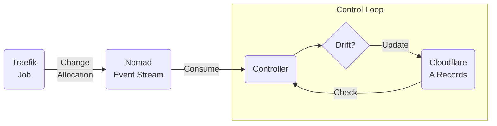

# Nomad Traefik Cloudflare Controller

A Nomad controller to control Cloudflare records for Traefik nodes.

Let's say you're using Traefik to expose services in your Nomad cluster.
Let's say that Traefik is running as a service in Nomad itself.
Let's say you want a common hostname for that Traefik will serve requests for, and you're managing DNS with a Cloudflare account.

If that's not you, then this is not for you.

But that happens to be me, so I wrote this little controller.

## Concept

The basic concept is that there is a control loop between the Nomad nodes where the Traefik job is allocated, and the A records in Cloudflare that point to them.

